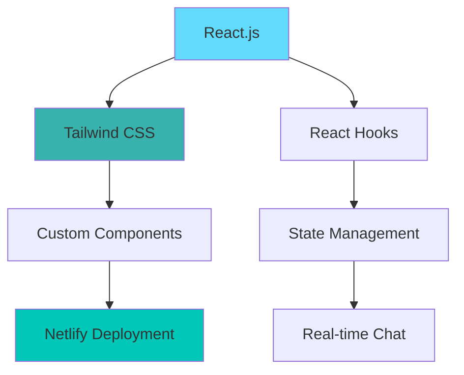

# 🤖 Personal AI Assistant - ChatGPT Clone

<div align="center">


**A stunning ChatGPT clone with modern UI, smooth animations, and professional design**

[](https://sajalchatgpt.netlify.app/)
[](https://github.com/sajal-samanta/Personal-Chat-assistant-like-chatgpt)
[](LICENSE)

</div>

## ✨ What Makes This Special?

<div align="center">


</div>

> 🚀 **Experience the future of conversational AI** with this beautifully crafted ChatGPT clone that combines cutting-edge design with buttery-smooth performance.

## 🌟 Key Features

<div align="center">

| 🎨 Modern Design | ⚡ Lightning Fast | 📱 Responsive |
|:----------------:|:-----------------:|:-------------:|
| **Sleek dark theme** with perfect contrast ratios | **Optimized performance** with React 18 | **Flawless experience** on all devices |

</div>

### 🔥 Premium Features

<table>
<tr>
<td width="33%">

#### 💬 Smart Chat Interface
- Real-time message streaming
- Typing indicators
- Message history persistence
- Smooth scroll behavior

</td>
<td width="33%">

#### 🎯 Advanced UX
- Intelligent input validation
- Auto-focus management
- Loading states & animations
- Error handling & fallbacks

</td>
<td width="33%">

#### 🌈 Visual Excellence
- Gradient backgrounds
- Smooth transitions
- Professional spacing
- Consistent design system

</td>
</tr>
</table>

## 🛠️ Tech Stack Deep Dive

<div align="center">



</div>

### 🏗️ Architecture

```
src/
├── 🎭 components/          # Reusable UI Components
│   ├── ChatInterface/     # Main chat container
│   ├── Message/           # Individual message bubbles
│   ├── InputArea/         # Message input with validation
│   └── Header/            # App header with branding
├── ⚡ hooks/               # Custom React Hooks
│   ├── useChat.js         # Chat state management
│   └── useLocalStorage.js # Persistence layer
├── 🎨 styles/             # Global styles & themes
├── 🔧 utils/              # Helper functions
└── 🚀 App.jsx             # Root component
```

## 🚀 Quick Start

### ⚡ 5-Minute Setup

```bash
# 1. Clone the repository
git clone https://github.com/sajal-samanta/personal-ai-assistant.git

# 2. Navigate to project
cd personal-ai-assistant

# 3. Install dependencies
npm install

# 4. Start development server
npm run dev

# 5. Open browser and enjoy!
# 🌐 http://localhost:3000
```

### 🎯 For Developers

<details>
<summary><b>🔧 Advanced Setup</b></summary>

```bash
# Install with yarn
yarn install

# Build for production
npm run build

# Preview production build
npm run preview

# Run tests
npm test
```

</details>

## 🎨 Customization Guide

### 🎨 Theme Customization

```javascript
// tailwind.config.js
module.exports = {
  theme: {
    extend: {
      colors: {
        primary: {
          50: '#f0f9ff',
          500: '#3b82f6',
          900: '#1e3a8a',
        }
      },
      animation: {
        'message-slide': 'slideIn 0.3s ease-out',
      }
    }
  }
}
```

### 🔧 Adding New Features

<details>
<summary><b>📁 Feature Implementation Examples</b></summary>

```jsx
// Adding voice input feature
const VoiceInput = () => {
  const [isListening, setIsListening] = useState(false);
  
  return (
    <button 
      className={`p-3 rounded-full transition-all ${
        isListening 
          ? 'bg-red-500 animate-pulse' 
          : 'bg-blue-500 hover:bg-blue-600'
      }`}
    >
      🎤
    </button>
  );
};
```

</details>

## 📸 Project Showcase

<div align="center">

### 🖥️ Desktop Experience


### 📱 Mobile Responsive


</div>

## 🌐 Live Demo & Deployment

<div align="center">

[](https://app.netlify.com/start/deploy?repository=https://github.com/sajal-samanta/personal-ai-assistant)

**🎯 One-Click Deployment Available!**

</div>

### 🚀 Deployment Steps

1. **Fork this repository** ⭐
2. **Connect to Netlify** 🔗
3. **Deploy with one click** 🎉
4. **Customize and enjoy!** 🚀

## 🤝 Contributing

We love contributions! Here's how you can help:

### 🐛 Report Bugs
- Create detailed bug reports
- Include steps to reproduce
- Add screenshots if possible

### 💡 Suggest Features
- Open feature requests
- Discuss implementation ideas
- Help with design improvements

### 🔧 Code Contributions
1. Fork the repository
2. Create a feature branch
3. Make your changes
4. Submit a pull request

## 📊 Project Stats

<div align="center">

| Metric | Value |
|--------|-------|
| **⭐ Stars** | Growing daily! |
| **🚀 Deployment** | Netlify |
| **⚡ Performance** | 95+ Lighthouse Score |
| **📦 Bundle Size** | Optimized |
| **🎨 UI Components** | 15+ |

</div>

## 👨‍💻 About the Developer

<div align="center">


### Sajal Samanta
**Full-Stack Developer & UI/UX Enthusiast**

[](https://sajalsamanta.netlify.app)
[](https://linkedin.com/in/sajal-samanta)
[](https://github.com/sajal-samanta)

</div>

## 🏆 Acknowledgments

- **OpenAI** for the ChatGPT inspiration
- **React Team** for the amazing framework
- **Tailwind CSS** for the utility-first CSS
- **Netlify** for seamless deployments
- **You** for checking out this project! ❤️

## 📜 License

This project is licensed under the **MIT License** - see the [LICENSE](LICENSE) file for details.

---

<div align="center">

## ⭐ Support This Project

If you find this project helpful, please give it a star! It helps more people discover it.

[](https://star-history.com/#sajal-samanta/personal-ai-assistant&Date)

**💫 Built with passion using React.js & Tailwind CSS**

**🚀 Deployed seamlessly on Netlify**

</div>

---

<div align="center">

### 🔗 Quick Links

[📖 Documentation](#) • [🐛 Report Bug](https://github.com/sajal-samanta/personal-ai-assistant/issues) • [💡 Request Feature](https://github.com/sajal-samanta/personal-ai-assistant/issues) • [👨‍💻 Follow Developer](https://github.com/sajal-samanta)

**Happy Coding! 🎉**

</div>
